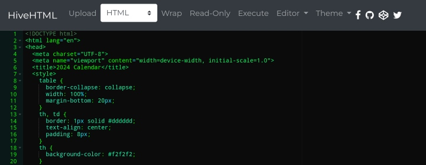

# HiveHTML - Code Editor

HiveHTML is a collaborative and efficient code editor designed with a primary focus on HTML, but now expanded to support various programming languages. Join the coding hive and experience versatile code editing with features.

# Screenshots

- [Live Demo](https://johndev19.github.io/HiveHTML/)





## Disclaimer

HiveHTML uses the Ace Editor for code editing, a product of Ajax.org. HiveHTML is created by **John Ré Poras**.

```plaintext
Copyright (c) 2024 John Ré Poras

Permission is hereby granted, free of charge, to any person obtaining a copy of this software and associated documentation files (the "Software"), to deal in the Software without restriction, including without limitation the rights to use, copy, modify, merge, publish, distribute, sublicense, and/or sell copies of the Software, and to permit persons to whom the Software is furnished to do so, subject to the following conditions:

The above copyright notice and this permission notice shall be included in all copies or substantial portions of the Software.

THE SOFTWARE IS PROVIDED "AS IS", WITHOUT WARRANTY OF ANY KIND, EXPRESS OR IMPLIED, INCLUDING BUT NOT LIMITED TO THE WARRANTIES OF MERCHANTABILITY, FITNESS FOR A PARTICULAR PURPOSE, AND NONINFRINGEMENT. IN NO EVENT SHALL THE AUTHORS OR COPYRIGHT HOLDERS BE LIABLE FOR ANY CLAIM, DAMAGES, OR OTHER LIABILITY, WHETHER IN AN ACTION OF CONTRACT, TORT, OR OTHERWISE, ARISING FROM, OUT OF, OR IN CONNECTION WITH THE SOFTWARE OR THE USE OR OTHER DEALINGS IN THE SOFTWARE.
```

# Features

1. **Search & Replace:**
   - Search and replace functionality.
   - Perform operations conveniently with a centered form.

2. **Upload:**
   - File and wallpaper uploads.
   - Choose files with the file input and manage wallpaper uploads.

3. **Language Selector:**
   - Select your preferred programming language.
   - Options include HTML, JavaScript, Markdown, Plain Text, Python, Go, C++, CSS, C#, Ruby.

4. **Toggle Features:**
   - Toggle various features for customization.
   - Options include Word Wrap, Read-Only, Line Numbers, Syntax Highlighting.

5. **Editor Options:**
   - Various editor options.
   - Options include Select All, Undo, Redo, Copy, Delete All, Format Code, Increase/Decrease Font Size.

6. **Theme Selection:**
   - Choose your preferred theme.
   - Options include various themes like Ambiance, Chaos, Clouds, Cobalt, etc.

7. **Execute Code:**
   - Execute your code with a single click.

8. **Autocomplete Function:**
   - Use Ctrl-Space (Win) or Command-Space (Mac) to trigger autocompletion.
   - Automatically completes HTML tags or adds closing braces in appropriate contexts.

9. **Font Size Adjustment:**
    - Increase or decrease the font size for better visibility.
    - Accessible through dedicated buttons in the editor options dropdown.

10. **Autosave Feature:**
    - Enable autosave to automatically save content at specified intervals.
    - Protect against accidental data loss with periodic autosaving.

11. **Custom Wallpaper:**
    - Set a custom wallpaper for the editor background.
    - Enhance the visual appearance of the coding environment.

12. **Toggle Line Numbers:**
    - Show or hide line numbers in the editor.
    - Toggle easily for code navigation.

13. **Toggle Syntax Highlighting:**
    - Enable or disable syntax highlighting for the code.
    - Adapt the editor to different coding preferences.

14. **Change Theme:**
    - Select from a variety of themes to customize the editor's appearance.
    - Choose a theme that suits your coding style.

15. **Search & Replace Function:**
    - Utilize a search and replace dropdown for efficient code editing.
    - Find and replace text with ease.

16. **Auto Generate HTML Comment:**
    - Automatically generate HTML comments based on selected tags.
    - Enhance code documentation within HTML.

17. **Comment Navigation:**
    - Navigate between comments in the code.
    - Use keyboard shortcuts for efficient comment navigation.

## Connect with me

Stay connected with John Ré Poras and get updates on HiveHTML:

- [Facebook](https://www.facebook.com/IamJohnPoras.org)
- [GitHub](https://github.com/JohnDev19/)
- [CodePen](https://codepen.io/JohnDev19)
- [Twitter](https://x.com/John_dev19?t=QoSiDgpcHqExkS2nkZtY-g&s=07)

## Bootstrap Modal for Output

A Bootstrap modal is used to display code output:

```html
<!-- Bootstrap Modal for Output -->
<div class="modal fade" id="outputModal" tabindex="-1" role="dialog" aria-labelledby="outputModalLabel" aria-hidden="true">
  <div class="modal-dialog" role="document">
    <div class="modal-content">
      <div class="modal-header">
        <i class="fa fa-times close-icon" onclick="closeOutputModal()" style="font-size: 24px;"></i>
      </div>
      <div class="modal-body" id="outputModalBody"></div>
    </div>
  </div>
</div>
```


- **Author:** John Ré Poras

Feel free to contribute and enhance the HiveHTML code editor!
